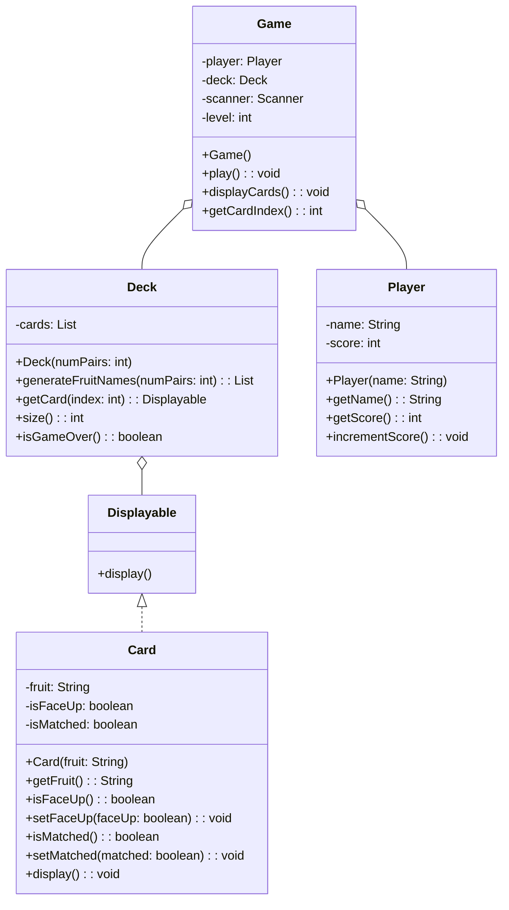

# MemoryGame_OOP_FinalProject

```mermaid
classDiagram
    class Displayable {
        +display()
    }
    class Card {
        -fruit: String
        -isFaceUp: boolean
        -isMatched: boolean
        +Card(fruit: String)
        +getFruit(): String
        +isFaceUp(): boolean
        +setFaceUp(faceUp: boolean): void
        +isMatched(): boolean
        +setMatched(matched: boolean): void
        +display(): void
    }
    class Deck {
        -cards: List<Displayable>
        +Deck(numPairs: int)
        +generateFruitNames(numPairs: int): List<String>
        +getCard(index: int): Displayable
        +size(): int
        +isGameOver(): boolean
    }
    class Player {
        -name: String
        -score: int
        +Player(name: String)
        +getName(): String
        +getScore(): int
        +incrementScore(): void
    }
    class Game {
        -player: Player
        -deck: Deck
        -scanner: Scanner
        -level: int
        +Game()
        +play(): void
        +displayCards(): void
        +getCardIndex(): int
    }

    Displayable <|.. Card
    Deck o-- Displayable
    Game o-- Player
    Game o-- Deck

```
